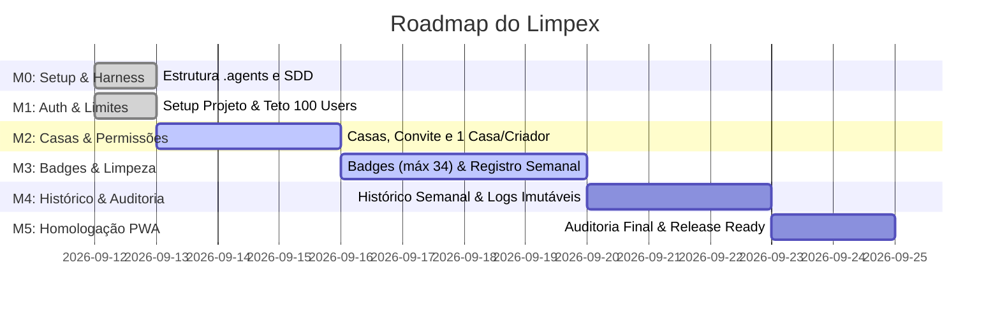

# Plano de Desenvolvimento Faseado do Limpex (Roadmap)

Este roadmap organiza a construção do Limpex em marcos de entrega sucessivos, garantindo que a base técnica, a experiência de usuário e as restrições inegociáveis de negócio sejam validadas a cada etapa.

---

## Visão Geral dos Marcos (Milestones)

---

## Detalhamento dos Marcos

### Milestone 0: Harness Engineering & Setup SDD (Concluído)
- **Objetivo**: Implementar o centro de inteligência e governança na pasta `.agents/`.
- **Entregas**:
  - `AGENTS.md` com diretrizes comportamentais e regras de ouro.
  - Regras de arquitetura (`01-architecture-sdd.md`), UX mobile (`02-mobile-ux-guidelines.md`) e limites de segurança (`03-security-and-limits.md`).
  - Skills do agente: `spec-driven-dev`, `backlog-manager` e `compliance-audit`.
  - Workflows e templates BDD padronizados.
  - Backlog hierárquico e referências de domínio.
- **Critério de Aceite**: Harness validado, integrado e referenciado no repositório.

---

### Milestone 1: Fundação, Autenticação e Teto Global de 100 Usuários (Concluído)
- **Objetivo**: Inicialização do projeto frontend mobile-first, configuração do banco de dados e garantia intransponível da barreira de 100 usuários.
- **Entregas**:
  - `TSK-101`: Setup do projeto frontend com React PWA, TypeScript e Design Tokens em Vanilla CSS.
  - `TSK-102`: Esquemas de banco de dados e migração SQL das 7 tabelas do Supabase.
  - `TSK-103`: Trigger PostgreSQL `BEFORE INSERT` bloqueando o 101º cadastro com `USERS_CAP_REACHED`.
  - `TSK-104`: Função RPC e hook reativo `useSystemCapacity` para verificação prévia.
  - `TSK-105`: Tela inicial mobile com alternância login/cadastro e banner adaptativo de limite atingido.
  - `TSK-106`: Autenticação completa por Nome + E-mail + Senha (com toggle de visibilidade) e Google OAuth.
  - `TSK-107`: Suíte unificada de testes E2E validando os 7 gates de conformidade e auditoria visual no app.
- **Critério de Aceite**: Tentativa de registrar o 101º usuário é estritamente bloqueada na interface e rejeitada no banco de dados. 100% dos 7 gates aprovados.

---

### Milestone 2: Gestão de Casas, Membros e Convites
- **Objetivo**: Gestão de residências com geração de código de convite e garantia de 1 casa por proprietário.
- **Entregas**:
  - Modelagem e migração de `houses` e `house_members`.
  - Restrição única de 1 casa criada por usuário.
  - Geração de código de convite de 6 caracteres e fluxo de adesão por código.
  - Tela/Aba de Casas (Criar, Vincular e Alternar).
  - Exclusão de casa restrita exclusivamente ao proprietário (TSK-205), com log de auditoria e liberação do `UNIQUE(creator_id)`.
  - Seletor de casa ativa no topo do aplicativo (TSK-204), alternando entre as casas do usuário em qualquer aba com persistência da escolha.
  - Runner consolidado de testes do Épico 2 (TSK-206) — 5 gates / 50 cenários de domínio validando o bloqueio da 2ª casa (`HOUSE_LIMIT_REACHED`), convite, multi-casa e exclusão proprietária.
- **Critério de Aceite**: Usuário não consegue criar mais de 1 casa; consegue participar de múltiplas casas via código de convite.

---

### Milestone 3: Sistema de Badges (Máx 34) e Registro de Faxina
- **Objetivo**: Implementar a gestão de tags e a tela central de registro de faxinas com a navegação fixa inferior.
- **Entregas**:
  - Seed automático dos 14 badges do sistema para cada nova casa (TSK-301 — concluído: fonte única `badgeDefinitions.ts`, trigger `handle_new_house` no banco, seed no mock e teste 10/10 + runner `runEpic3Audit.ts`).
  - Tela de Gestão de Badges com trava em 20 customizados / 34 totais por casa (TSK-302 concluído — SPEC-010; TSK-303 concluído — SPEC-011: modal de criação `BadgeCreateModal.tsx` com validação `badgeCreation.ts` e trava RN-11/RN-12; TSK-304 concluído — SPEC-012: edição/renomeação de badges `BadgeEditModal.tsx` + `badgeEdit.ts` + `dbService.renameBadge` restrita ao criador via RN-21; TSK-305 concluído — SPEC-013: exclusão de badges `BadgeDeleteModal.tsx` de confirmação destrutiva + `badgeDelete.ts` + `dbService.deleteBadgeWithLog` restrita ao criador via RN-21 com log obrigatório de auditoria RN-15/Restrição nº 5 e isolação RN-19; runner do Épico 3 com 5 gates / 148 testes).
  - Regra RBAC: apenas o criador pode criar, editar ou excluir badges.
  - Suíte consolidada do Épico 3 (TSK-306 — concluído): runner `runEpic3Audit.ts` com 5 gates / 148 testes aprovados (100%), validando o teto de 34 badges (Restrição nº 3 / RN-11 e RN-12) e as permissões de criador vs membro (Restrição nº 4 / RN-21) nas camadas de domínio e de serviço.
  - Componente Bottom Navbar fixa de 5 posições com botão central "+ Faxina" em destaque (TSK-401 concluído — SPEC-014: `navConfig.ts` fonte única de verdade, componente config-driven `BottomNavbar.tsx`, teste 13/13 + Gate 1 de `runEpic4Audit.ts`).
  - Modal/Tela de registro de faxina com seleção de responsável, dia, badges e observações (TSK-402 concluído — SPEC-015: `cleaningRegistration.ts` camada de domínio RN-09, tela `CleaningFormPanel.tsx` no Item Central da Navbar com responsável/dia pré-selecionados, chips de badges da casa ativa RN-19 e observações `{n}/500`, payload `CleaningRecord` pronto para a TSK-403; teste 37/37 + Gate 2 do runner `runEpic4Audit.ts` com 2 gates / 50 verificações).
  - Tela Principal exibindo as faxinas da semana vigente com cards expansíveis (> 2 itens) (TSK-404 concluído — SPEC-017: `cleaningWeekView.ts` camada de domínio com contexto semanal determinístico (RN-08/RN-24), cards reais da semana via `getCleaningRecords` + resolução de nomes de badges; teste 39/39 + Gate 4 do runner `runEpic4Audit.ts`).
  - Micro-animação fluida a 60fps do card expansível para mais de 2 tarefas (TSK-405 concluído — SPEC-018: `cardExpandable.ts` camada de domínio, componente modular `CleaningCard.tsx` com gaveta CSS Grid `0fr ➔ 1fr`, rotação do chevron de 180° em 250ms e gaveta de notas acessível com suporte a `prefers-reduced-motion`; teste 30/30 + Gate 5 do runner `runEpic4Audit.ts` com 5 gates / 169 verificações).
  - Backend e persistência dos registros de faxina (TSK-403 concluído — SPEC-016: migração `cleaning_persistence_rls` com RLS/triggers RN-19/RN-20 e CHECK de `week_number` 1..4; `dbService.createCleaningRecord` + `dbService.getCleaningRecords` com isolamento RN-19 e filtros por semana; cascata de exclusão de casa/badge com auditoria preservada; ponte `handleSubmitCleaning` → backend no `App.tsx`; teste 50/50 + Gate 3 do runner `runEpic4Audit.ts` com 3 gates / 100 verificações).
  - Ícone indicativo visual para registros com observações/ressalvas (TSK-406 concluído — SPEC-019: camada de domínio `cleaningNotesIndicator.ts` com derivação determinística e sanitização estrita, componente `CleaningCard.tsx` com botão tátil ergonômico ≥ 44x44px, badge dot para alerta no estado colapsado, estado ativo em gradiente ciano, gaveta de notas acessível `aria-expanded`/`aria-controls` e suporte resiliente a textos até 500 caracteres com quebra de palavras segura; teste 41/41 + Gate 6 do runner `runEpic4Audit.ts` totalizando 6 gates / 210 verificações).
- **Critério de Aceite**: Criador adiciona novos badges até o limite de 34; membros registram faxinas; botão central da navbar abre fluxo de registro com 1 toque.

---

### Milestone 4: Histórico de Limpezas e Auditoria de Exclusões
- **Objetivo**: Histórico retroativo organizado por semanas e sistema de auditoria imutável de exclusões.
- **Entregas**:
  - Agrupamento semanal no formato `"Semana X de [Mês] de [Ano]"`.
  - Blocos horizontais dos 7 dias (`dom` a `sab`) com cores diferenciadas nos dias com faxina.
  - Visualização condicional (apenas semanas com faxinas são exibidas).
  - Tabela `exclusion_logs` com gravação automática de logs na exclusão de casas e badges.
- **Critério de Aceite**: Exclusão de qualquer badge ou casa gera log imediato com autor, data/hora e item; cards de histórico expandem consolidado da semana.

---

### Milestone 5: Homologação Mobile, PWA e Polimento UX
- **Objetivo**: Verificação final de acessibilidade, testes E2E e instalação PWA.
- **Entregas**:
  - Configuração do Service Worker e `manifest.json` para instalação mobile na Home Screen.
  - Auditoria completa via skill `compliance-audit`.
  - Validação de safe areas em iOS e Android.
- **Critério de Aceite**: 100% dos testes passando; checklist de release aprovada sem pendências.
