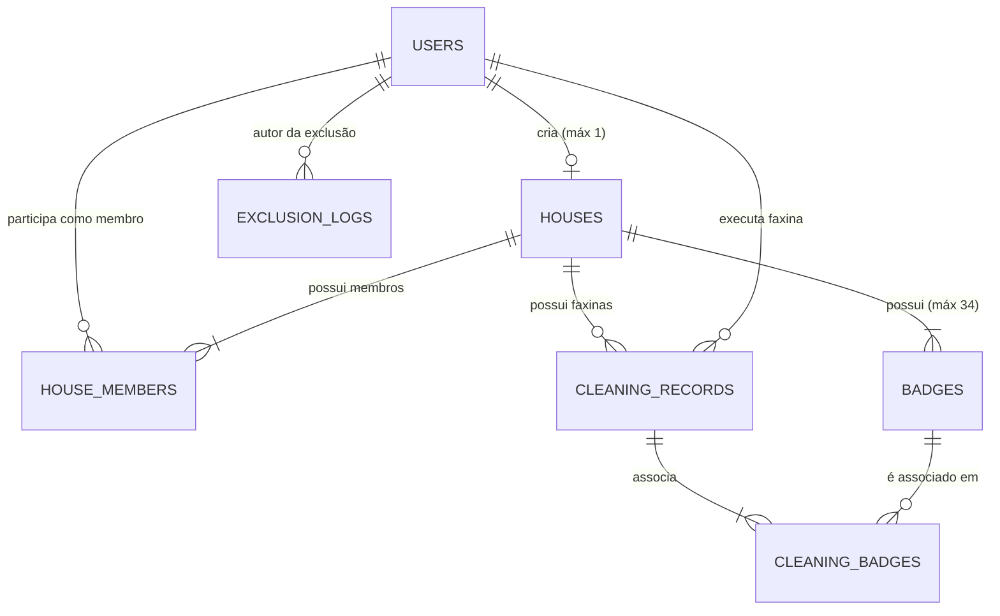

# Modelo de Domínio e Dados (Domain Model)

Este documento descreve a modelagem conceitual, relacional e as entidades que compõem o ecossistema do Limpex.

---

## 1. Diagrama Entidade-Relacionamento (ERD)

---

## 2. Descrição das Entidades

### 2.1. `users`
Armazena o perfil do usuário no aplicativo.
- `id`: UUID (Primary Key, vinculado a `auth.users`)
- `name`: TEXT (Nome completo de exibição)
- `email`: TEXT (E-mail único)
- `avatar_url`: TEXT (Opcional, foto de perfil do Google ou padrão)
- `created_at`: TIMESTAMPTZ

### 2.2. `houses`
Representa uma residência criada no Limpex.
- `id`: UUID (Primary Key)
- `name`: TEXT (Nome da casa, ex: "Casa de Praia", "Ap 402")
- `invite_code`: TEXT (Código de 6 a 8 caracteres, único e indexado)
- `creator_id`: UUID (Foreign Key para `users`, restrição `UNIQUE` para garantir máx. 1 casa por criador)
- `created_at`: TIMESTAMPTZ
- `updated_at`: TIMESTAMPTZ

### 2.3. `house_members`
Tabela associativa de relacionamento N:N entre usuários e casas.
- `id`: UUID (Primary Key)
- `house_id`: UUID (Foreign Key para `houses`)
- `user_id`: UUID (Foreign Key para `users`)
- `role`: TEXT ('CREATOR' ou 'MEMBER')
- `joined_at`: TIMESTAMPTZ
- *Constraint*: `UNIQUE(house_id, user_id)`

### 2.4. `badges`
Itens e tarefas de limpeza vinculados a uma casa específica.
- `id`: UUID (Primary Key)
- `house_id`: UUID (Foreign Key para `houses`)
- `name`: TEXT (Ex: "Cozinha", "Banheiro", "Quarto 1")
- `is_system`: BOOLEAN (True para os 14 padrões; False para customizados)
- `display_order`: INTEGER (Ordenação visual)
- `created_at`: TIMESTAMPTZ
- *Validação de negócio*: Contagem total por `house_id` $\le 34$; customizados $\le 20$.

### 2.5. `cleaning_records`
Registros individuais de faxina executados em uma semana.
- `id`: UUID (Primary Key)
- `house_id`: UUID (Foreign Key para `houses`)
- `user_id`: UUID (Foreign Key para `users`, o responsável que executou a faxina)
- `registered_by_id`: UUID (Foreign Key para `users`, quem preencheu o registro)
- `day_of_week`: TEXT ('dom', 'seg', 'ter', 'qua', 'qui', 'sex', 'sab')
- `cleaning_date`: DATE (Data real em que a limpeza ocorreu)
- `week_number`: INTEGER (1 a 4, semana do mês)
- `month`: INTEGER (1 a 12)
- `year`: INTEGER (Ex: 2026)
- `notes`: TEXT (Observações/ressalvas opcionais)
- `created_at`: TIMESTAMPTZ

### 2.6. `cleaning_badges`
Tabela associativa que vincula tarefas executadas a um registro de faxina.
- `cleaning_record_id`: UUID (Foreign Key para `cleaning_records`)
- `badge_id`: UUID (Foreign Key para `badges`)
- *Constraint*: Primary Key composta `(cleaning_record_id, badge_id)`

### 2.7. `exclusion_logs`
Tabela imutável de auditoria de eventos de exclusão.
- `id`: UUID (Primary Key)
- `deleted_at`: TIMESTAMPTZ (Data/hora do evento)
- `user_id`: UUID (Autor da exclusão)
- `user_name`: TEXT (Nome do autor no momento da exclusão)
- `entity_type`: TEXT ('HOUSE' ou 'BADGE')
- `entity_id`: UUID (Identificador do objeto deletado)
- `entity_name`: TEXT (Nome do objeto deletado)
- `house_id`: UUID (Casa relacionada)
- `metadata`: JSONB (Dados adicionais contextuais)
