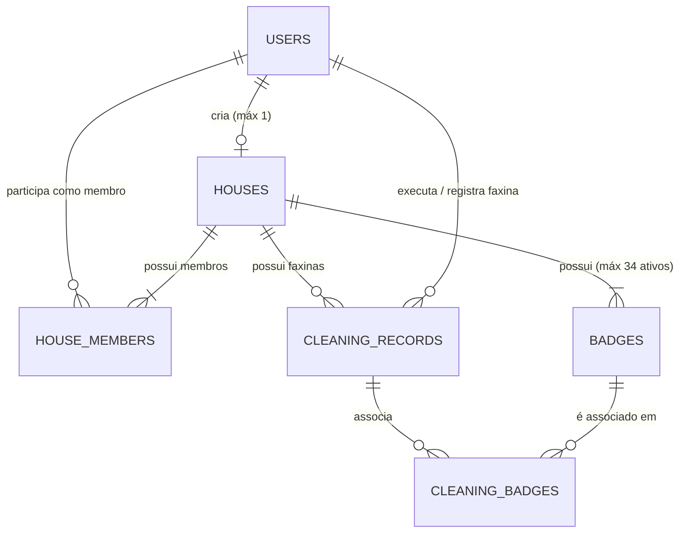

# Modelo de Domínio e Dados (Domain Model)

Este documento descreve a modelagem conceitual, relacional e as entidades que compõem o ecossistema do Limpex.

> **Fonte da verdade:** as migrações em [`supabase/migrations/`](../../supabase/migrations/) (baseline da [SPEC-021](../specs/SPEC-021-database-baseline.md)). Este documento é um resumo; em caso de divergência, valem as migrações.

---

## 1. Diagrama Entidade-Relacionamento (ERD)

```mermaid
erDiagram
    USERS ||--o| HOUSES : "cria (máx 1)"
    USERS ||--o{ HOUSE_MEMBERS : "participa como membro"
    HOUSES ||--|{ HOUSE_MEMBERS : "possui membros"
    HOUSES ||--|{ BADGES : "possui (máx 34 ativos)"
    HOUSES ||--o{ CLEANING_RECORDS : "possui faxinas"
    USERS ||--o{ CLEANING_RECORDS : "executa / registra faxina"
    CLEANING_RECORDS ||--o{ CLEANING_BADGES : "associa"
    BADGES ||--o{ CLEANING_BADGES : "é associado em"
```

`exclusion_logs` não tem chaves estrangeiras: o log sobrevive à exclusão do que registra.

---

## 2. Descrição das Entidades

### 2.1. `users`
Perfil público do usuário, criado automaticamente por trigger quando a conta é criada em `auth.users`.
- `id`: UUID (PK e FK para `auth.users`)
- `name`: TEXT (1 a 80 caracteres; vem do cadastro, do `full_name` do Google ou do e-mail)
- `email`: TEXT (único)
- `avatar_url`: TEXT (opcional, foto do Google)
- `created_at`: TIMESTAMPTZ
- *Regra*: no máximo 100 contas, garantido por trigger em `auth.users` (`USERS_CAP_REACHED`).

### 2.2. `houses`
- `id`: UUID (PK)
- `name`: TEXT (1 a 40 caracteres)
- `invite_code`: TEXT (6 caracteres de `ABCDEFGHJKLMNPQRSTUVWXYZ23456789`, único, gerado no banco; pode ser regenerado pelo criador)
- `creator_id`: UUID (FK para `users`, `UNIQUE`: no máximo 1 casa por criador)
- `created_at`, `updated_at`: TIMESTAMPTZ

### 2.3. `house_members`
Relação N:N entre usuários e casas.
- `house_id`: UUID (FK para `houses`)
- `user_id`: UUID (FK para `users`)
- `role`: TEXT (`CREATOR` ou `MEMBER`)
- `joined_at`: TIMESTAMPTZ
- *Constraint*: PK composta `(house_id, user_id)`

### 2.4. `badges`
- `id`: UUID (PK)
- `house_id`: UUID (FK para `houses`)
- `name`: TEXT (1 a 40 caracteres; único por casa entre os ativos, sem diferenciar maiúsculas)
- `is_system`: BOOLEAN (true para os 14 padrões)
- `display_order`: INTEGER
- `created_at`: TIMESTAMPTZ
- `deleted_at`: TIMESTAMPTZ (exclusão lógica; badge excluído continua visível no histórico)
- *Regra*: até 34 ativos por casa, dos quais até 20 customizados (trigger).

### 2.5. `cleaning_records`
- `id`: UUID (PK)
- `house_id`: UUID (FK para `houses`)
- `user_id`: UUID (FK para `users`, o responsável que executou a faxina)
- `responsible_name`: TEXT (cópia do nome no momento do registro; preserva o histórico de quem saiu da casa)
- `registered_by_id`: UUID (FK para `users`, quem preencheu o registro)
- `cleaning_date`: DATE (data civil no horário de Brasília; nunca futura e nunca anterior à criação da casa)
- `notes`: TEXT (até 500 caracteres)
- `created_at`, `updated_at`: TIMESTAMPTZ
- *Regra (SPEC-020)*: `cleaning_date` é a única fonte da verdade. Dia da semana, semana (domingo a sábado), mês e ano são derivados dela, em `src/domain/week.ts` no app e em `public.week_start()` no banco.

### 2.6. `cleaning_badges`
- `cleaning_record_id`: UUID (FK para `cleaning_records`)
- `badge_id`: UUID (FK para `badges`)
- *Constraint*: PK composta `(cleaning_record_id, badge_id)`
- *Regra*: novos vínculos só com badges ativos da mesma casa. Ao excluir um badge, só as faxinas da semana atual perdem o vínculo.

### 2.7. `exclusion_logs`
Log imutável (triggers bloqueiam `UPDATE`, `DELETE` e `TRUNCATE` para qualquer papel). Gravado somente pelas RPCs, na mesma transação da exclusão.
- `id`: UUID (PK)
- `deleted_at`: TIMESTAMPTZ (data/hora do evento)
- `user_id`, `user_name`, `user_email`: autor da ação
- `entity_type`: TEXT (`HOUSE`, `BADGE` ou `MEMBER`)
- `entity_id`, `entity_name`: o que foi excluído (para `MEMBER`, o usuário que saiu ou foi removido)
- `house_id`: UUID (casa relacionada)
- `metadata`: JSONB
  - `HOUSE`: contagens afetadas
  - `BADGE`: vínculos removidos e preservados
  - `MEMBER`: ação `LEAVE` ou `REMOVE`
- `created_at`: TIMESTAMPTZ

---

## 3. Acesso

- **Leitura:** via RLS, apenas membros da casa. Perfis: o próprio ou de quem divide alguma casa.
- **Escrita:** somente pelas funções RPC listadas na [SPEC-021 §5](../specs/SPEC-021-database-baseline.md). Os papéis `anon` e `authenticated` não têm `INSERT`/`UPDATE`/`DELETE` em nenhuma tabela.
