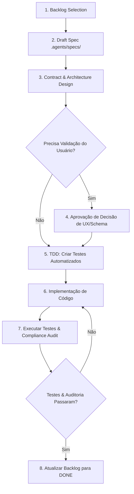

# Workflow: Ciclo de Vida de Features (Feature Lifecycle)

Este workflow descreve o procedimento operacional padrão para construir qualquer funcionalidade no Limpex utilizando o modelo Spec-Driven Development.

---

## Diagrama do Fluxo

---

## Etapas Detalhadas

### Fase 1: Seleção e Alinhamento
1. Acesse [.agents/backlog/backlog.md](file:///c:/projetos/limpex/.agents/backlog/backlog.md).
2. Escolha o item de maior prioridade disponível cujas dependências estejam satisfeitas.
3. Mude o status do item para `IN_PROGRESS`.

### Fase 2: Elaboração da Especificação Técnica
1. Copie o template [.agents/templates/feature-spec-template.md](file:///c:/projetos/limpex/.agents/templates/feature-spec-template.md) para `.agents/specs/SPEC-<NUMERO>-<nome>.md`.
2. Especifique:
   - Os requisitos funcionais e não funcionais.
   - Cenários BDD (`Given-When-Then`).
   - Contratos de tipos (TypeScript/Zod).
   - Telas e componentes necessários respeitando [.agents/rules/02-mobile-ux-guidelines.md](file:///c:/projetos/limpex/.agents/rules/02-mobile-ux-guidelines.md).
   - Restrições aplicáveis conforme [.agents/rules/03-security-and-limits.md](file:///c:/projetos/limpex/.agents/rules/03-security-and-limits.md).

### Fase 3: Desenvolvimento Guiado por Testes (TDD)
1. Escreva testes automatizados que representem os cenários descritos na spec.
2. Os testes devem falhar inicialmente (fase Red).
3. Implemente o código da funcionalidade até que todos os testes passem (fase Green).
4. Refatore o código mantendo os testes verdes e respeitando as boas práticas de arquitetura (fase Refactor).

### Fase 4: Auditoria de Conformidade e Finalização
1. Execute a checklist da skill [.agents/skills/compliance-audit/SKILL.md](file:///c:/projetos/limpex/.agents/skills/compliance-audit/SKILL.md).
2. Verifique se o alvo de toque no mobile está respeitando os 44px e safe areas.
3. Marque a tarefa como `DONE` no backlog.
